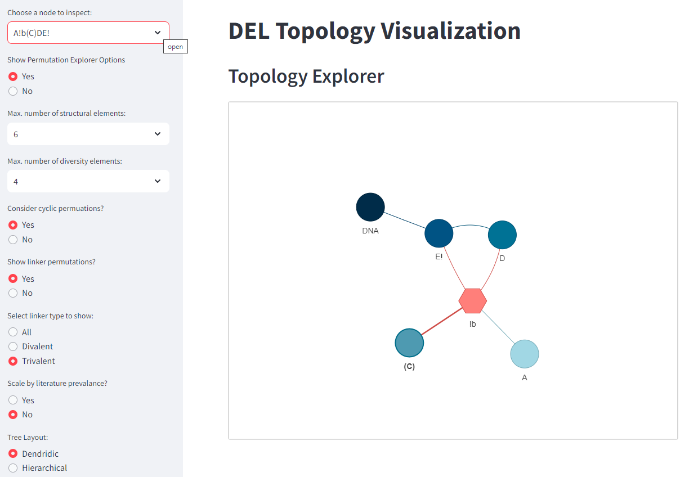

# DELTAexplorer

A Streamlit application for visualizing the topology (arrangement) of the diversity elements within a DNA Encoded Library (DEL).   

Use the Streamlit Application with the link below: 
[https://wkweigel-deltaexplorer-deltaexplorer-78jiy4.streamlit.app/](https://wkweigel-deltaexplorer-deltaexplorer-78jiy4.streamlit.app/)  
For more details, please see the associated publication here: 
[Evaluation of the Topology Space of DNA-Encoded Libraries](https://doi.org/10.1021/acs.jcim.3c01008)
